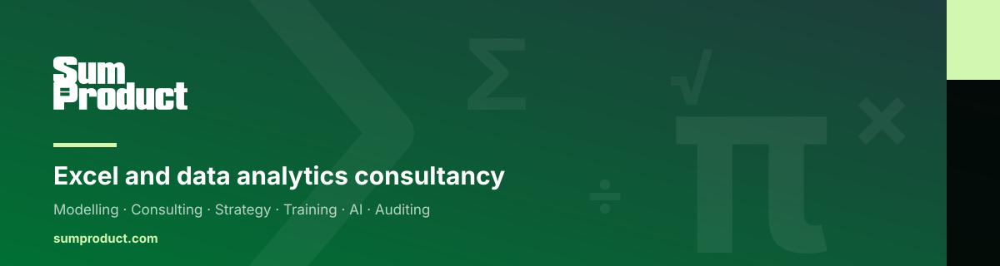

<picture>
  <source media="(prefers-color-scheme: dark)" srcset="assets/banner-dark.svg">
  <source media="(prefers-color-scheme: light)" srcset="assets/banner-light.svg">
  
</picture>

  
  

## About us

> We help organisations redefine their direction, and improve performance.

SumProduct is a specialist Microsoft Excel and data analytics consultancy. We are finance and
accounting professionals who solve complex problems and build highly specialised models. Our team
includes Microsoft MVPs in Excel and award-winning leaders in the field, and we work with
organisations across multiple sectors.

Between us we hold more than 100 years of combined experience. We publish a library of thought
leadership articles, courses and videos, and we host Excel Virtually Global — an annual event
that draws over 50 speakers and 3,500 attendees.

## What we do

| Service | What it means |
| :-- | :-- |
| **Modelling** | Building robust, dynamic financial and operational models. |
| **Consulting** | Expert guidance on data strategy and analytical challenges. |
| **Strategy** | Long-term data and technology roadmaps for organisations. |
| **Training** | Upskilling teams in Excel, Power BI and data best-practice. |
| **AI** | From AI to BI. |
| **Auditing** | Independent review of existing models, so errors surface before decisions rest on them. |

<!-- NOTE: the Auditing description above is still a draft awaiting approved wording. -->

## CRaFT

CRaFT is our proprietary system. We hold that a good financial model shows four qualities, and we
build and review against them.

| Quality | What it means |
| :-- | :-- |
| **Consistency** | Structured modelling that reduces errors and improves reliability. |
| **Robustness** | Simple, strong, auditable models — no hidden complexity, with error checks built in. |
| **Flexibility** | Interactive insight, so key assumptions can move within defined boundaries. |
| **Transparency** | Clear structure and consistent formulas, so the results can be trusted. |

[Read more about CRaFT →](https://www.sumproduct.com/about/)

## Our repositories

Most of our work is built directly in client environments and stays private. This organisation
holds the work we can share openly — tooling, templates and reference material that support the
services above.

<!-- As public repositories are published, list them here. Suggested format:

| Repository | What it does |
| :-- | :-- |
| [repo-name](https://github.com/SumProductTeam/repo-name) | One line, active voice, no full stop needed. |

-->

Nothing is public yet. If you are looking for something specific, [ask us](mailto:contact@sumproduct.com).

## Get in touch

- **Web** — [sumproduct.com](https://www.sumproduct.com)
- **Email** — [contact@sumproduct.com](mailto:contact@sumproduct.com)

---

© 2009 – 2026 SumProduct. All rights reserved.
